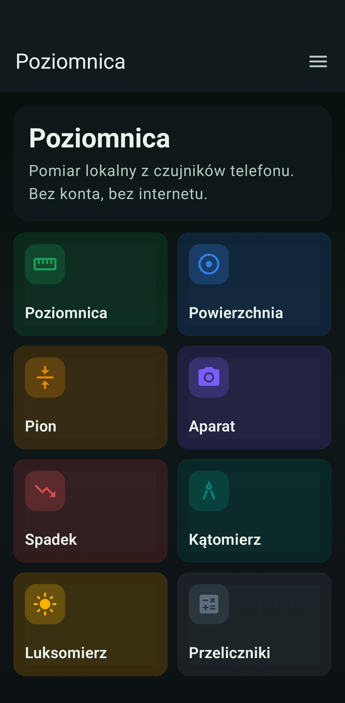
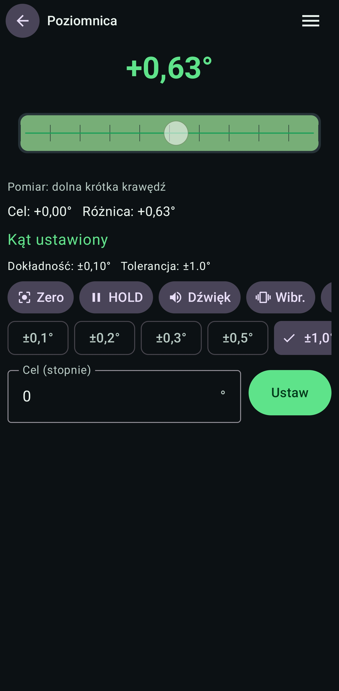
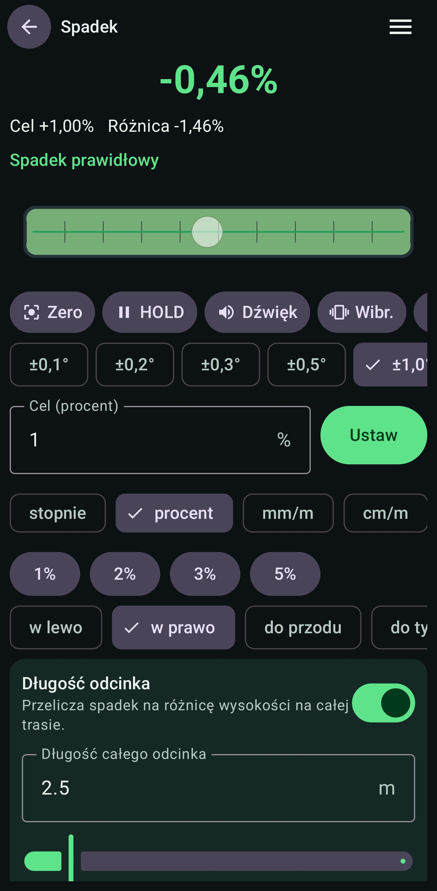
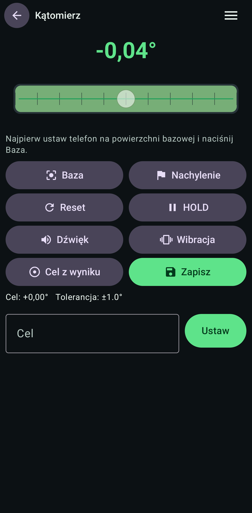
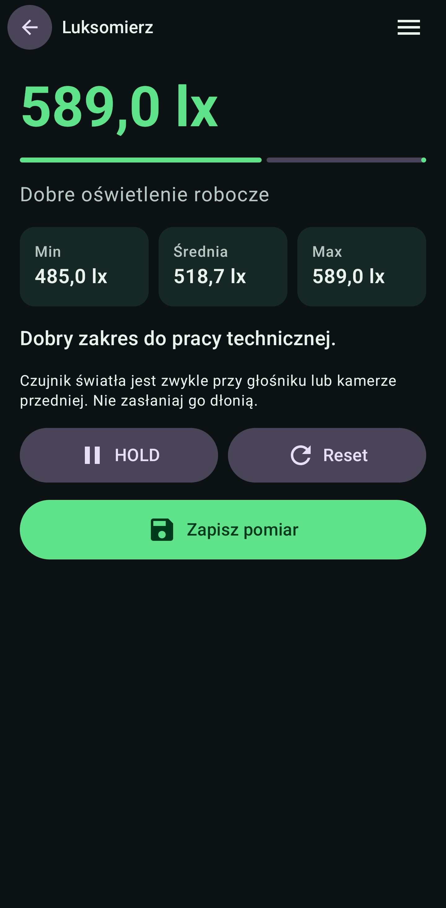
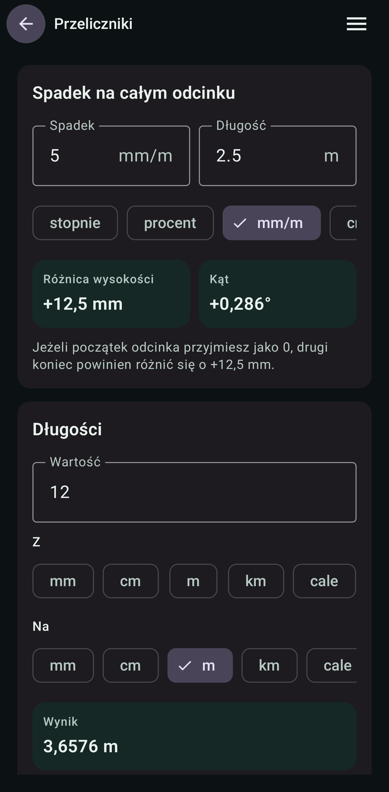

# Poziomnica Android

Natywna aplikacja Android do pomiarow poziomu, pionu, spadku, kata i dokumentacji zdjeciowej z wykorzystaniem czujnikow telefonu oraz CameraX.

Repozytorium:

`https://github.com/Belfer4108/Poziomnica-Android`

## Pobieranie

Gotowy plik APK po lokalnym zbudowaniu:

`dist/poziomnica.apk`

Na GitHub plik APK powinien byc dolaczany jako zalacznik do sekcji **Releases**. Sam plik APK nie jest trzymany w repozytorium z kodem.

## Zrzuty ekranu

| Ekran glowny | Poziomnica | Powierzchnia |
|---|---|---|
|  |  |  |
| Modulowy ekran startowy z kafelkami pomiarow i narzedzi. | Klasyczna poziomnica z celem, tolerancja, HOLD, dzwiekiem i wibracja. | Okragla poziomnica do stolow, pralek, maszyn i innych plaskich powierzchni. |

| Aparat | Spadek | Katomierz |
|---|---|---|
|  |  |  |
| CameraX z siatka, liniami poziomu/pionu, latarka, blokada ekspozycji i zdjeciami z nakladka. | Spadek w stopniach, procentach, mm/m i cm/m, z przeliczeniem na cala dlugosc odcinka. | Pomiar kata miedzy powierzchnia bazowa i drugim nachyleniem. |

| Ustawienia | Historia | FAQ i przeliczniki |
|---|---|---|
|  |  |  |
| Sekcje wygladu, pomiaru, dzwieku, aparatu i uprawnien. | Lokalna historia pomiarow z podgladem, eksportem i udostepnianiem. | Przeliczniki dlugosci, spadku i roznicy wysokosci na odcinku. |

## Glowne funkcje

- poziomnica liniowa z obsluga krawedzi telefonu,
- poziomowanie powierzchni w dwoch osiach,
- tryb pionu,
- tryb spadku z przeliczaniem jednostek i dlugosci odcinka,
- katomierz z baza i pomiarem nachylenia,
- tryb aparatu z nakladka pomiarowa,
- zapis zdjec do galerii w folderze `Poziomnica`,
- blokada ekspozycji i ostrosci na srodku kadru w aparacie,
- lokalna historia pomiarow,
- eksport i udostepnianie pomiarow,
- kalibracja tylnej obudowy oraz krawedzi,
- ustawienia aplikacji w DataStore,
- lokalna baza Room,
- dzwiek i wibracje jako sygnal osiagniecia celu,
- pomiar natezenia oswietlenia,
- przeliczniki dlugosci, kata i spadku.

## Technologie

- Kotlin,
- Jetpack Compose,
- Material 3,
- MVVM,
- Android Sensor API,
- CameraX,
- Room,
- DataStore,
- Kotlin Coroutines i StateFlow,
- Navigation Compose.

## Struktura pakietow

- `audio` - sygnaly dzwiekowe,
- `calibration` - logika kalibracji,
- `camera` - obsluga aparatu i zapisu zdjec,
- `data` - kontener zaleznosci aplikacji,
- `database` - encje, DAO i baza Room,
- `domain` - modele i obliczenia domenowe,
- `export` - eksport pomiarow,
- `navigation` - trasy i nawigacja,
- `repository` - repozytoria danych,
- `sensors` - odczyt i filtrowanie czujnikow,
- `settings` - ustawienia DataStore,
- `ui` - ekrany i komponenty Compose,
- `utils` - funkcje pomocnicze,
- `vibration` - obsluga wibracji,
- `viewmodel` - ViewModel dla ekranow.

## Uruchomienie

1. Otworz projekt w Android Studio.
2. Poczekaj na synchronizacje Gradle.
3. Podlacz telefon z wlaczonym debugowaniem USB albo uruchom emulator.
4. Uruchom konfiguracje `app`.

## Budowanie APK

Debug APK:

```powershell
.\gradlew.bat assembleDebug
```

Plik wynikowy:

`app/build/outputs/apk/debug/app-debug.apk`

Podpisany release APK:

```powershell
.\gradlew.bat assembleRelease
```

Plik wynikowy po przygotowaniu paczki:

`dist/poziomnica.apk`

## Podpisywanie

Podpis release korzysta z lokalnego pliku `keystore.properties` oraz lokalnego klucza `poziomnica-release.jks`. Oba pliki sa ignorowane przez Git i nie powinny byc publikowane.

## Gdzie zmienic dane aplikacji

- nazwa aplikacji: `app/src/main/res/values/strings.xml`,
- ikona: `app/src/main/res/drawable` oraz `app/src/main/res/mipmap-*`,
- identyfikator pakietu: `applicationId` i `namespace` w `app/build.gradle.kts`,
- wersja: `versionCode` i `versionName` w `app/build.gradle.kts`.

## Licencja

Licencja publiczna nie zostala jeszcze wybrana. Do czasu dodania pliku licencji kod pozostaje bez publicznie nadanej licencji open source.
